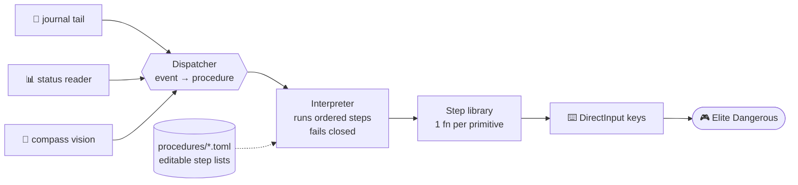

# ED-AFK 🛸

> **Robots that fly spaceships so you don't have to stay awake.**

A monorepo of AFK automation tools for *Elite Dangerous: Odyssey*. The first
tool, **`ed-autojump`**, drives the keyboard to take a ship from system A to
system B, over and over, while you sleep — arrive, honk, get clear of the star,
orient at the next route star, jump, repeat.

<p>
  
  
  
  <a href="https://github.com/Quadstronaut/ED-AFK/actions/workflows/test.yml"></a>
  
</p>

---

## 🤔 What is this?

`ed-autojump` is an autoexploration bot. **v1** is one thing done well —
**Component 1: automated A→B navigation.** No FSS, no DSS, no docking, no
fancy route planning. Just: don't ram the star, and jump to the next system.

It works by tailing the game's own public data files (the Player Journal and
`Status.json`), reading the in-cockpit nav compass with computer vision, and
synthesizing keystrokes via DirectInput. The architecture is the interesting
part: a **step library + an interpreter + human-editable per-procedure TOML
files**. You tune the bot's behaviour by editing a list, not by editing code.

> ⚠️ **Honest disclaimer.** Automating gameplay is against the *Elite Dangerous*
> Terms of Service. This repo is a personal, educational architecture
> exercise — a study in event-driven control, fail-closed safety, and
> data-as-config. Run it at your own risk.

---

## ⚙️ How it works

Three readers feed a dispatcher; the dispatcher picks a procedure; the
interpreter runs that procedure's steps in order and **fails closed**; each step
calls one tested function that presses keys into the game.



A LIVE `FSDJump` event runs the `arrival` procedure; a fresh load sitting at a
star runs `startup`; an emergency drop inside a star's exclusion zone
(`SupercruiseExit` with `BodyType: Star`) runs `smack_recovery`. Replayed
backlog events only update state — they never press a key. The interpreter walks
each procedure top-to-bottom, tracking per-step success, and any failed
`required` step aborts the run **without ever throttling forward or jumping**.

---

## 📝 The editable procedures

This is the whole idea. **Every named procedure is an ordered, reorderable list
of steps living in its own TOML file** under `projects/ed-autojump/procedures/`.

- Reorder behaviour by **moving lines**. Duplicate a step? Totally fine.
- **Every number is a live-tune knob** — orbit settle times, throttle percents,
  retry counts — all data, all in execution order.
- The loader validates every procedure at startup: unknown action, unbound key,
  or bad `retry_from` and the bot **refuses to run** rather than improvising.

Here's the `arrival` procedure verbatim — the one that runs on every jump:

```toml
[on_required_fail]
retry_from = "sc_assist_orbit"   # re-orbit changes the geometry; a 2nd orient at the same obstructed angle would just fail again
max_retries = 3
backoff_s = 2.0

steps = [
  { action = "target_ahead" },                       # lock the arrival star (nav-panel top row)
  { action = "sc_assist_orbit" },                    # orbit AROUND the star -> unobstruct the next hop
  { action = "wait", s = 10.0 },                     # orbit settles; honk finishes in parallel
  { action = "target_next_route" },                  # H: cancels SC-assist + locks next system
  { action = "set_throttle", pct = 100 },
  { action = "wait", s = 10.0 },
  { action = "orient_compass", required = true },    # cyan compass; target now UNOBSTRUCTED; fails closed
  { action = "engage_jump", required = true },       # SetSpeed100 + FSD; only after orient confirms
]
```

The other v1 procedures:

- **`startup`** — fresh load, ship sitting in normal space at a star. Pitch the
  star to the compass edge, throttle, engage supercruise, orient, jump. No orbit
  (orbit is arrival-only).
- **`honk`** — the **one parallel track.** At the start of `arrival`/`startup`
  the dispatcher launches it on a background thread: hold the discovery-scanner
  key, and **terminate the moment the `FSSDiscoveryScan` event lands** (or a hard
  timeout). It's a plain key hold, independent of everything else.
- **`smack_recovery`** — the reflex for when you drop *inside* a star's
  exclusion zone. Face directly away, wait out the long FSD cooldown, ride the
  game's escape-vector marker back into supercruise, get clear, then jump.

---

## 🧰 The v1 step library

Every step is `{ action = "<name>", <params> }` and returns `ok: bool`. Mark a
step `required = true` and a failure triggers the procedure's retry/abort policy.

| action | does | fails when |
|---|---|---|
| `press` | press a bound ED action for `hold_s` | bind unbound |
| `wait` | sleep `s` seconds | never |
| `set_throttle` | press `SetSpeedN` for `pct ∈ {0,25,50,75,100}` | bind unbound |
| `pitch` | dead-reckoned pitch up/down for `hold_s` (no vision) | bind unbound |
| `pitch_compass` | compass-gated pitch until the star's dot hits the rim (`edge`) or goes centred + hollow (`behind`) | star not confirmed in budget |
| `wait_for_event` | block until the journal logs `event` | timeout |
| `target_ahead` | `SelectTarget` — locks the body ahead, or **clears** the target if nothing's there | bind unbound |
| `target_next_route` | `TargetNextRouteSystem` (also cancels SC-assist) | bind unbound |
| `sc_assist_orbit` | orbit the star via the nav-panel SC-assist macro — *get around it* | any bind unbound |
| `engage_supercruise` | press `Supercruise`, confirm SC entry via Status flag | SC entry not logged in time |
| `orient_compass` | `align_to_target` on the cyan nav compass | not aligned / no compass wiring |
| `engage_jump` | re-check status, `SetSpeed100`, `HyperSuperCombination` | blocked flag, or bind unbound |

`orient_compass` and `engage_jump` are the steps normally marked `required` —
that pairing is *exactly* what makes the jump fail closed.

---

## ⭐ Why it stopped ramming the star

The old orchestrator oriented the ship at the **next jump target** the instant
it arrived. The orient logic was correct — it hit the coordinate. The problem:
that coordinate is frequently **hidden directly behind the arrival star**, so
"pointing at the target" meant pointing *through the star*, and the bot
throttled straight into it.

The fix is the maneuver a human would do: on arrival, **engage Supercruise
Assist to orbit the star.** That moves the ship's angular position so the next
hop is unobstructed — *then* orient, *then* jump. And the jump now **fails
closed**: it fires only after orientation is positively confirmed. If the
compass is degraded or the orient fails, the procedure aborts — no throttle, no
jump. The old code failed *open* (a missing compass unlocked the jump anyway).
That single inversion — fail open → fail closed — is the safety contract this
whole redesign exists to guarantee.

---

## 🗺️ Scope

**v1 is deliberately narrow: functional A→B route jumping that doesn't ram the
star.** The architecture is built to scale into the rest without rework — new
behaviour is a new file in `procedures/`, not surgery on the existing ones.

| | v1 (now) | v2+ (earmarked) |
|---|---|---|
| **In** | A→B navigation: arrive → honk → get clear → orient → jump | Hi-res, near-realtime compass vision (smooth turns, not jank-stepping) |
| | Fail-closed jump gate | Brightness directional grid (know *which way* the star is) |
| | Editable TOML procedures + step library | Refuel & docking procedures |
| | | Ships *without* SC-assist / Advanced Docking Computer |

**Out of v1 scope entirely:** FSS, DSS, EDDN publishing, Spansh auto-plot, the
launcher/menu-nav wizard, and brightness/HUD detection. v1 **assumes** SC-assist
and an Advanced Docking Computer are fitted.

---

## 📂 Repo layout

```
ED-AFK/
├── README.md                  <- you are here
├── LICENSE                    <- MIT (repo root)
├── THIRD_PARTY_NOTICES.md     <- attribution + the AGPL model note
├── docs/
│   ├── shared/                <- cross-tool reference (journal events, FSD, star classes)
│   └── superpowers/specs/     <- design specs (incl. the v1 procedure-interpreter design)
└── projects/
    └── ed-autojump/           <- first tool: the autoexploration bot
        ├── LICENSE            <- AGPL-3.0 (the shippable distribution)
        ├── config.toml        <- runtime config (vision region, nav knobs, ...)
        ├── procedures/        <- the editable step-list TOML files live here
        ├── src/ed_autojump/   <- journal/ status/ keys/ vision/ executor/ ...
        └── tests/             <- offline unit + interpreter + procedure-validation tests
```

---

## 🧭 Pointers

- **Config** lives in `projects/ed-autojump/config.toml` (vision region, nav
  knobs, and the rest of the runtime settings).
- **Procedures** live in `projects/ed-autojump/procedures/` — the editable
  surface described above.
- **The full v1 design** (the source of truth this README condenses) is
  [`docs/superpowers/specs/2026-05-25-procedure-interpreter-design.md`](./docs/superpowers/specs/2026-05-25-procedure-interpreter-design.md).
- The per-tool README with setup details is
  [`projects/ed-autojump/README.md`](./projects/ed-autojump/README.md).

---

## 📜 License & attribution

The repository root is **MIT** (see [`LICENSE`](./LICENSE)). However, the
**`ed-autojump` distribution is licensed AGPL-3.0-or-later** (see
[`projects/ed-autojump/LICENSE`](./projects/ed-autojump/LICENSE)): it bundles the
nav-compass detection model, whose Ultralytics weights are AGPL-3.0, and AGPL is
viral over the combined work. If you don't ship the bundled model, the OpenCV
fallback needs no weights at all.

<details>
<summary>Borrowed patterns &amp; constants</summary>

Full chain in [`THIRD_PARTY_NOTICES.md`](./THIRD_PARTY_NOTICES.md):

- **[SumZer0-git/EDAPGui](https://github.com/SumZer0-git/EDAPGui)** (MIT) —
  DirectInput scancode table, `.binds` parser shape, Status/NavRoute poller
  patterns, nav-compass alignment approach. The bundled compass model weights
  (`compass.onnx` / `compass.pt`) are **AGPL-3.0** (Ultralytics).
- **[EDCD/coriolis-data](https://github.com/EDCD/coriolis-data)** (MIT) — FSD
  per-class/rating constants.
- **[EDCD/EDDN](https://github.com/EDCD/EDDN)** (BSD-2-Clause) — schema field
  reference for journal/exploration events.
- **[EDCD/FDevIDs](https://github.com/EDCD/FDevIDs)** (MIT) — module Item IDs.

Frontier-supplied data (`.binds` schema, journal/Status field names) comes from
the public Player Journal Manual; no Frontier files are modified or
redistributed.

</details>

---

<sub>github.com/Quadstronaut/ED-AFK · A study in fail-closed control · Fly safe, CMDR. o7</sub>
