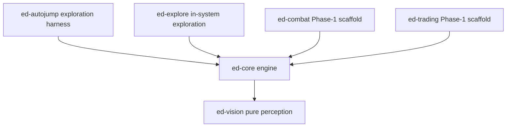
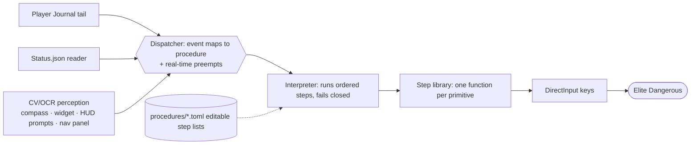

# ED-AFK

**An experiment in AI-driven workflows acting on an external data source** · *alpha*

  
  
  
  
  

  
  
  
  
  

---

---

## At a glance

| | |
|---|---|
| **Platform** | Windows (PC *Elite Dangerous: Odyssey*) |
| **Language** | Python 3.11+ |
| **Status** | Alpha — working experiment, not a finished product |
| **Latest release** | [**v0.2.0 — Jump Release**](https://github.com/Quadstronaut/ED-AFK/releases/tag/v0.2.0) · A→B jump + refuel + honk, tested ~24h live on Twitch (900+ jumps) |
| **License (root)** | MIT |
| **License (ed-autojump)** | AGPL-3.0-or-later |
| **Shippable tool** | `ed-autojump` |

---

## 🔭 What it is

ED-AFK is an experiment in **AI-driven workflows** and how well they can read,
interpret, and act on an **external data source** in real time. The whole point
is the workflow engine: a set of three live readers that feed a dispatcher,
which maps an observed event to a named procedure, which an interpreter then
executes one ordered step at a time. *Elite Dangerous* happens to be the
external data source the engine is wired to; it is the test fixture, not the
subject.

The game earns that role because it emits one of the cleanest machine-readable
data feeds of any consumer application (see the Terms-of-Service section for
why that matters). The repository is a layered, six-package Python workspace
that turns that feed into decisions and decisions into synthetic input.

---

## ⚙️ What it does

The engine watches the external data source, decides what state the world is
in, and runs the procedure that matches. For the *Elite Dangerous* fixture it
flies a repetitive multi-jump loop **and recovers from the things that go wrong
along the way**: on arrival at a star it idles the throttle, optionally scoops
fuel, locks the next route hop, clears the geometry, orients (nav-compass coarse
+ mouse-widget fine), and jumps; at the end of a route it parks or docks. A
**real-time scene monitor** preempts the running procedure to recover from
mid-flight events — a fresh system arrival, a star-smack drop back into normal
space, or a server-drop **CONNECTION ERROR** screen (which it clears and
re-enters the game in Solo, then re-plots the route). The discovery-scanner
honk, an FSD-malfunction wait-and-refire, an obstruction get-around, and a
never-strand re-dispatch all live in the same loop.

Maturity, honestly: this is **alpha** software, but the core is no longer
paper-only. The steady-state jump loop is **live-validated over hundreds of
consecutive jumps** — including a cross-galaxy run toward Colonia — while the
offline suite covers the engine, routing, and step library against recorded data
and fakes. Docking and the rarer recovery paths are still under active live
validation, there are open edges that can occasionally strand a run, and the
combat and trading packages are Phase-1 scaffolds that register nothing yet. No
finished-product claims — a working experiment that now actually flies.

---

## 🚀 How to use it

1. **Windows + Python 3.11+.** This targets PC *Elite Dangerous: Odyssey*. The
   external application must be running and in foreground focus.
2. **Install the workspace.** Each package under `projects/` is an editable
   install; the shippable tool is `ed-autojump`. See its per-tool README at
   `projects/ed-autojump/README.md` for setup, calibration, and the CLI.
3. **Install the bundled input preset** and select it in the application, then
   run the one-time per-machine vision calibration.
4. **Plot a route, then run `ed-autojump`.** With no route plotted the engine
   sits idle and nothing moves — it only acts when the data source gives it an
   event to act on.
5. **Tune by editing data, not code.** Every procedure is a TOML file under
   `projects/ed-autojump/procedures/`; reorder steps by moving lines and adjust
   timings/counts in place. The loader validates each procedure at startup and
   refuses to run on an unknown action, unbound key, or bad reference.

> [!CAUTION]
> Do not run this against the live service. See the Terms-of-Service section
> below — this is for **LEARNING PURPOSES ONLY**.

---

## 🏗️ How it's put together

A layered, six-package workspace under `projects/`. The dependency direction is
the load-bearing fact, so the convention is pinned explicitly:

> **Edge convention for the diagram below: an edge `A --> B` means "A depends on B" — the arrow points from the dependent package to the package it depends on.**

The domain packages depend on `ed-core`; `ed-core` depends on `ed-vision`;
`ed-vision` depends on neither (it is the leaf).

```mermaid
flowchart TD
    autojump[ed-autojump exploration harness] --> core[ed-core engine]
    explore[ed-explore in-system exploration] --> core
    combat[ed-combat Phase-1 scaffold] --> core
    trading[ed-trading Phase-1 scaffold] --> core
    core --> vision[ed-vision pure perception]
```

One line of intent per package (all six):

- **ed-core** — the engine: dispatcher, interpreter, step registry, boot-scene
  determination, and the shared flight primitives every domain reuses.
- **ed-vision** — pure perception: frames in, measurements out; it sends no keys
  and depends on nothing else in the workspace.
- **ed-autojump** — the exploration harness and the one shippable tool
  (AGPL-3.0-or-later); it bundles the editable TOML procedures.
- **ed-explore** — in-system exploration (body tour and the autoexplore tour).
- **ed-combat** — combat domain, a Phase-1 scaffold that registers nothing yet.
- **ed-trading** — trading domain, a Phase-1 scaffold that registers nothing yet.

---

## ⚠️ Terms of Service warning

> [!CAUTION]
> Running this against the production, live *Elite Dangerous* game **violates the
> *Elite Dangerous* Terms of Service.** Plainly: **do not do it.** Automating
> gameplay on the live service can get an account actioned, and this project is
> not endorsed by or affiliated with Frontier Developments. This software is
> provided for **LEARNING PURPOSES ONLY** — as a study of AI-driven workflows
> against a structured external data source.
>
> *Elite Dangerous* was chosen for exactly one reason: it exposes a **unique,
> highly structured, high-output log format.** The game continuously writes the
> **Player Journal** (a line-delimited JSON event stream), **Status.json** (a
> live flag/state snapshot), and **NavRoute.json** (the plotted route). Few
> consumer applications publish anything like this volume of clean, well-typed,
> real-time machine-readable state. That feed is what makes the game an ideal
> external data source for the experiment — the value is the data shape, not the
> gameplay.

---

## 🔁 How it operates

Three readers feed a dispatcher; the dispatcher selects a procedure; the
interpreter runs that procedure's ordered steps and **fails closed**; each step
calls exactly one function that sends DirectInput keystrokes to the game.

```mermaid
flowchart LR
    journal[Player Journal tail] --> dispatcher
    status[Status.json reader] --> dispatcher
    cv[CV/OCR perception<br/>compass · widget · HUD prompts · nav panel] --> dispatcher
    dispatcher{{Dispatcher: event maps to procedure<br/>+ real-time preempts}} --> interpreter
    interpreter[Interpreter: runs ordered steps, fails closed] --> steps[Step library: one function per primitive]
    steps --> keys[DirectInput keys]
    keys --> game([Elite Dangerous])
    procs[(procedures/*.toml editable step lists)] -.-> interpreter
```

The readers only ever update state; they never press a key directly. The
interpreter walks each procedure top to bottom, tracks per-step success, and
any failed required step aborts the run **without ever throttling forward or
firing the jump**. That fail-closed contract is deliberate: when alignment is
not positively confirmed, the engine stops rather than guessing.

Maturity caveat, restated where it belongs: this runtime is **alpha**, but the
jump loop is now proven at scale — **hundreds of consecutive live jumps**, not
just replayed recordings. The journal tail, dispatcher routing, interpreter
step-walking, and the CV/OCR perception layer are also covered by an offline
unit + replay suite. Docking and the rarer recovery paths remain under live
validation; treat those as still-proving, and expect the occasional open edge.

---

## 🐛 What people should do if they have a problem

Open an issue at `https://github.com/Quadstronaut/ED-AFK/issues`. Include the
relevant slice of the Player Journal and `Status.json` (anonymize commander and
system names if you wish), the procedure that was running, the exact step that
failed, and what you expected versus what happened. Because the interpreter logs
per-step success and fails closed, the failing step name is usually the fastest
route to a diagnosis. Do not attach data captured from the live service if doing
so would put your account at risk.

---

## 🤝 What people should do if they want to contribute

Contributions are welcome as pull requests against `master`. Keep changes small
and well-scoped so any single commit is cleanly revertable. Behavior changes
should come with tests — unit or replay-based — since live testing is not always
available. Note the licensing split before you start: code touching the
shippable `ed-autojump` distribution falls under AGPL-3.0-or-later (see
Licensing), while the rest of the workspace root is MIT. Open an issue first for
anything large so the design can be discussed before you build it.

---

## 📄 Licensing

- **Repository root: MIT** — see `LICENSE` (its first line reads `MIT License`).
- **`ed-autojump` distribution: AGPL-3.0-or-later** — see
  `projects/ed-autojump/LICENSE` (`GNU AFFERO GENERAL PUBLIC LICENSE Version 3`).

The AGPL-3.0 is **viral over the combined work**: `ed-autojump` bundles the
nav-compass detection model whose Ultralytics weights (`compass.onnx` /
`compass.pt`) are AGPL-3.0, so the entire distribution that ships those weights
carries AGPL-3.0-or-later obligations. If you do **not** ship the bundled model,
the **OpenCV fallback backend needs no weights at all** and that obligation does
not attach.

Third-party attributions (full chain in <code>THIRD_PARTY_NOTICES.md</code>)

| Source | License | Used for |
|---|---|---|
| [SumZer0-git/EDAPGui](https://github.com/SumZer0-git/EDAPGui) | MIT | DirectInput scancode table, `.binds` parser shape, Status/NavRoute poller patterns, nav-compass alignment approach |
| [EDCD/coriolis-data](https://github.com/EDCD/coriolis-data) | MIT | FSD per-class/rating constants |
| [EDCD/EDDN](https://github.com/EDCD/EDDN) | BSD-2-Clause | Schema field reference for journal/exploration events |
| [EDCD/FDevIDs](https://github.com/EDCD/FDevIDs) | MIT | Module Item IDs |

---

a 👨🏻‍🚀 Quadstronaut project of https://starhold.dev/

