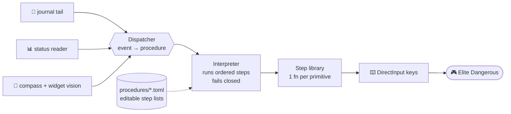

# ED-AFK 🛸

> **An assistive automation harness for *Elite Dangerous* — it performs the
> sustained, timing-critical piloting that a player's hands or hardware may not
> be able to, so the exploration loop stays open to people the game's control
> surface would otherwise lock out.**

A monorepo of automation tools for *Elite Dangerous: Odyssey*. The first and
primary tool, **`ed-autojump`**, flies the repetitive multi-jump exploration
loop end to end: dodge the arrival star, honk, scoop fuel, orient at the next
route star, jump — and dock at the end. It reads the game's own public data
(the Player Journal, `Status.json`, `NavRoute.json`), reads the cockpit with
computer vision (the nav compass + a HUD widget ring), and sends synthetic
keystrokes through a dedicated keyboard preset.

<p>
  
  
  
  <a href="https://github.com/Quadstronaut/ED-AFK/actions/workflows/test.yml"></a>
  
</p>

---

## 🤔 Why I built this — and who it's for

I started `ed-autojump` as an experiment in automating my favourite game: a
study in event-driven control and fail-closed safety. Somewhere along the way I
realised I'd built something with a more useful reason to exist than my own
convenience.

*Elite Dangerous* has one of the heaviest control surfaces in PC gaming.
Players describe a single keyboard/HOTAS setup as taking an hour or more just to
half-configure, with "ten times as many key commands as the most complex flight
sims." The bundled control preset in this repo has to cover the game's full
action surface — hundreds of distinct bindable ship actions — and even the
flying that uses only a handful of them is dexterity- and timing-heavy: analog
pitch/yaw alignment held steady through an FSD spool, multi-key nav-panel
macros, a fuel-scoop standoff, a docking-request sequence. That's a lot of
sustained, precise input.

For a player with limited mobility, that input burden can be the wall between
them and the game. The state of the art in adaptive hardware is remarkable —
the Xbox Adaptive Controller, sip-and-puff mouth controllers like the QuadStick,
one-switch scanning rigs — and the charities behind them ([AbleGamers](https://ablegamers.org/),
[SpecialEffect](https://www.specialeffect.org.uk/)) do extraordinary work. But
every one of those devices is still a *real-time manual input device*: it
remaps *how* you press, not *how much* you have to press. A breath-controlled
stick still demands the timing and sequencing the player performs themselves.
Specialised hardware also costs money — from under $20 to well over $500 — and
many disabled players are on fixed incomes. By one widely-cited AbleGamers
figure, roughly 1 in 5 US gamers (about 46 million people) live with a
disability. That's not a niche.

`ed-autojump` is a different, complementary angle on the same access problem:
free, open-source **software** that collapses a dexterity-heavy multi-key
maneuver down to *supervision* — oversight a low-bandwidth player can provide.
Conceptually it's a "whole-maneuver switch": the player stays in the loop via a
panic hotkey and the harness's fail-closed aborts, but the sustained piloting is
performed for them. The point is to **expand who gets to participate** — not to
play the game unattended for someone who could already play it themselves.

I'm not framing this as charity or as a finished assistive product. It's an
honest, in-progress tool built by one person, and the limitations below are
load-bearing. Disabled players are capable agents who know what they need; this
is one more option on the table, offered plainly.

> ⚠️ **Honest disclaimer — please read.** Automating gameplay is against the
> *Elite Dangerous* Terms of Service. The accessibility motivation is real but
> it does **not** change that contractual reality, and this project is **not**
> endorsed by or affiliated with Frontier Developments. This is **alpha**
> software and a personal tool — large parts of the loop are unit/replay-tested
> only, not proven live, and there are open defects that can strand or crash the
> ship (see [Honest status](#-honest-status--alpha-not-a-product)). Run it at
> your own risk, ideally with a helper for the one-time setup, and never treat
> it as a hands-off guarantee.

---

## ⚙️ How it works

Three readers feed a dispatcher; the dispatcher picks a procedure; the
interpreter runs that procedure's steps in order and **fails closed**; each step
calls one tested function that presses keys into the game.


```mermaid
flowchart LR
    J[📜 journal tail] --> D
    S[📊 status reader] --> D
    C[🧭 compass + widget vision] --> D
    D{{Dispatcher\nevent → procedure}} --> I
    I[Interpreter\nruns ordered steps\nfails closed] --> L[Step library\n1 fn per primitive]
    L --> K[⌨️ DirectInput keys] --> G([🎮 Elite Dangerous])
    P[(procedures/*.toml\neditable step lists)] -.-> I
```

A live `FSDJump` event runs the `arrival` procedure; a fresh load sitting at a
star runs `startup`; an emergency drop inside a star's exclusion zone
(`SupercruiseExit` with `BodyType: Star`) runs `smack_recovery`; a route that
ends at a station runs the `dock` lane. Replayed backlog events only update
state — they never press a key. The interpreter walks each procedure
top-to-bottom, tracking per-step success, and any failed `required` step aborts
the run **without ever throttling forward or jumping**.

The fail-closed contract is the heart of it. The bot **never** throttles toward
a star or fires the FSD without a positively-confirmed, maintained alignment. If
the compass read is degraded, the orientation never converges, or vision is
unwired, the procedure aborts rather than guessing. For an unattended or
low-bandwidth pilot that inversion — fail *open* → fail *closed* — is the whole
safety story (see [Why it stopped ramming the star](#-why-it-stopped-ramming-the-star)).

---

## 📝 The editable procedures

This is the architectural idea and the reason the tool can be tuned without
touching code. **Every named procedure is an ordered, reorderable list of steps
living in its own TOML file** under `projects/ed-autojump/procedures/`.

- Reorder behaviour by **moving lines**. Duplicate a step? Fine.
- **Every number is a live-tune knob** — orbit settle times, throttle percents,
  retry counts — all data, all in execution order.
- The loader validates every procedure at startup: unknown action, unbound key,
  or bad `retry_from` and the bot **refuses to run** rather than improvising.

The procedures shipped on `master` (all editable in
`projects/ed-autojump/procedures/`):

- **`arrival`** — runs on every live `FSDJump`. Zero throttle, optional fuel
  pit-stop, lock the arrival star via the identity-verified nav-panel macro,
  orbit with SC-assist to clear the geometry, lock the next route hop (with
  danger-class verification), burn clear, coarse-orient via the nav compass,
  fine-orient via the HUD widget ring, engage the jump, and hold alignment
  through the FSD spool. Honk runs in parallel.
- **`startup`** — fresh load in normal space at a star: a direct-jump first try
  with a full SC-assist orbit recovery lane behind it.
- **`sc_resume`** — fast resume when the ship is already in supercruise and
  clear of the star (no orbit get-around). *Note: this lane is the back end of
  open defect #2 below — it can throttle a nose-on-star ship into the star.*
- **`smack_recovery`** — reflex escape after dropping inside a star's exclusion
  zone: star astern, wait out the cooldown, ride the escape vector out, then
  orient and jump. *Has an open pitch-flip defect (#3 below).*
- **`route_complete_park`** — park in a holding orbit at a route that ends at a
  system/star.
- **`dock` / `dock_resume`** — the docking lane (target the station, SC-assist
  in, request docking, wait for the pad, then run Starport Services for
  refuel/repair/rearm) and the pit-stop relaunch when a new route is plotted
  while docked. *Docking has shipped but is broken on `master` — see defect #1.*
- **`honk`** — the parallel discovery-scan track: switch to analysis mode, hold
  the fire-group trigger until `FSSDiscoveryScan` lands (~5 s), release.

The full per-step table — every action, its gate, its failure policy, and its
known defects — lives in
[`docs/ACTION_MEGASHEET.md`](./docs/ACTION_MEGASHEET.md), the authoritative
audit, and the DSL reference is
[`projects/ed-autojump/procedures/procedures.md`](./projects/ed-autojump/procedures/procedures.md).

---

## ⭐ Why it stopped ramming the star

The old orchestrator oriented the ship at the **next jump target** the instant
it arrived. The orient logic was correct — it hit the coordinate. The problem:
that coordinate is frequently **hidden directly behind the arrival star**, so
"pointing at the target" meant pointing *through the star*, and the bot
throttled straight into it.

The fix is the maneuver a human would do: on arrival, **engage Supercruise
Assist to orbit the star**, moving the ship's angular position so the next hop
is unobstructed — *then* orient, *then* jump. And the jump now **fails closed**:
it fires only after orientation is positively confirmed. If the compass is
degraded or the orient fails, the procedure aborts — no throttle, no jump. The
old code failed *open* (a missing compass unlocked the jump anyway). That single
inversion — fail open → fail closed — is the safety contract this whole redesign
exists to guarantee, and it matters most precisely when no able-bodied pilot is
watching to catch a mistake.

---

## 🚦 Honest status — alpha, not a product

This section is deliberately prominent. An accessibility framing makes
overclaiming worse, not better, so here is the unvarnished state on `master`:

**What has shipped and is exercised offline:** the full flight loop (arrival /
startup / sc_resume / smack_recovery / route_complete_park), the docking lane
(`dock` / `dock_resume`), the parallel honk track, the star-class danger filter,
Spansh route auto-plotting (`--route-plot`), and game launch via MinEdLauncher.
The architecture is real and well-tested *offline*.

**What is genuinely not built:** FSS (full-spectrum-scan) and DSS (detailed
surface scan) remain framework stubs. The two older "phase status" tables that
used to live in these READMEs are retired — they predate the docking work and
under-described it.

**What is NOT live-tested:** large parts of the loop are unit- and
replay-tested only. The fuel-scoop pit-stop (`scoop_refuel`) and several flows
are explicitly marked *not live-tested*. You cannot be promised reliable
unattended operation today.

**Open defects that can strand or crash the ship** (full detail in
[`docs/ACTION_MEGASHEET.md`](./docs/ACTION_MEGASHEET.md), Part D):

1. **Docking is broken on `master`.** The `dock` lane is missing a
   `dock_approach` step, so SC-assist drops the ship *outside* the 7.5 km
   no-fire zone and the docking request is denied forever. The fix exists only
   on an unmerged branch.
2. **`sc_resume` can ram a star.** The dispatcher's P4 routing path can send a
   star-parked ship into a no-orbit throttle-100 fast path and drive it into the
   arrival star — there is no proximity/obstruction gate. Recovery (not
   prevention) currently catches it.
3. **`smack_recovery` can mis-flip.** The pitch-astern step has falsely reported
   "done" without actually flipping the ship, corrupting the escape sequence.
4. **Wall-clock gates remain** in `pitch_compass` (30 s) and `orient_widget_ring`
   (18 s), and `wait_cooldown_clear` is unbounded — reliability edges that
   matter more for an unattended user than for a supervising hobbyist.

**Hard requirements and constraints:** Windows only; PC *Elite Dangerous:
Odyssey* only (no console); the game must be running and in foreground focus;
**the ship must have Supercruise Assist (blue-zone throttle mode) and an
Advanced Docking Computer fitted**; a route must already be plotted (with none,
the bot sits idle and the ship never moves). It covers the single-player /
private-group **exploration** loop — not combat, trading, or on-foot.

**Setup needs dexterity/sight too** — this partly undercuts the accessibility
thesis unless a helper does the one-time install: install the bundled keyboard
preset and select it in-game, run per-machine vision calibration, optionally
per-commander menu calibration, and fit the in-game modules above. The honest
position is that a helper-assisted setup unlocks day-to-day independent use, not
that the tool is zero-setup.

If any of this changes, this section changes with it. It should always read as
the truth, not the pitch.

---

## 🗺️ Scope

| | Shipped (alpha, see caveats above) | Not built / future |
|---|---|---|
| **Flight** | A→B loop: arrive → honk → scoop → orient → jump | Hi-res near-realtime compass vision (smoother turns) |
| **Safety** | Fail-closed jump gate (danger-class filter, status flags) | FSS keyboard sweep / FSS CV-assisted |
| **Config** | Editable TOML procedures + step library | DSS 6-direction surface scan |
| **Docking** | `dock` / `dock_resume` lane *(broken on master — defect #1)* | Ships *without* SC-assist / Advanced Docking Computer |
| **Routing** | Spansh auto-plotting (`--route-plot`) | |
| **Launch** | Game launch via MinEdLauncher, menu navigation | |

---

## 📂 Repo layout

```
ED-AFK/
├── README.md                  <- you are here
├── LICENSE                    <- MIT (repo root)
├── THIRD_PARTY_NOTICES.md     <- attribution + the AGPL model note
├── docs/
│   ├── ACTION_MEGASHEET.md    <- authoritative per-step audit (gates, defects)
│   ├── shared/                <- cross-tool reference (journal events, FSD, star classes)
│   └── superpowers/specs/     <- design specs (incl. the procedure-interpreter design)
└── projects/
    └── ed-autojump/           <- first tool: the exploration harness
        ├── LICENSE            <- AGPL-3.0 (the shippable distribution)
        ├── config.toml        <- runtime config (vision region, nav knobs, ...)
        ├── procedures/        <- the editable step-list TOML files live here
        ├── src/ed_autojump/   <- journal/ status/ keys/ vision/ executor/ ...
        └── tests/             <- offline unit + interpreter + procedure-validation tests
```

---

## 🧭 Pointers

- **Setup, calibration, and CLI** — the per-tool README:
  [`projects/ed-autojump/README.md`](./projects/ed-autojump/README.md).
- **Config** lives in `projects/ed-autojump/config.toml` (vision region, nav
  knobs, runtime settings).
- **Procedures** live in `projects/ed-autojump/procedures/` — the editable
  surface described above.
- **The authoritative action audit** (every step, gate, and open defect) is
  [`docs/ACTION_MEGASHEET.md`](./docs/ACTION_MEGASHEET.md).
- **The original design spec** is
  [`docs/superpowers/specs/2026-05-25-procedure-interpreter-design.md`](./docs/superpowers/specs/2026-05-25-procedure-interpreter-design.md).

---

## ♿ Accessibility context & credit where it's due

This project sits — modestly, and without claiming their endorsement — in the
lineage of the people who built the field of adaptive gaming:

- **[AbleGamers](https://ablegamers.org/)** (US nonprofit, founded 2004 by Mark
  Barlet) and **[SpecialEffect](https://www.specialeffect.org.uk/)** (UK charity,
  founded 2007 by Dr. Mick Donegan) — free individualised assessments and
  equipment so people can play *no matter their disability*.
- The **[Xbox Adaptive Controller](https://www.xbox.com/en-US/accessories/controllers/xbox-adaptive-controller)**,
  co-designed with AbleGamers, SpecialEffect, the Cerebral Palsy Foundation and
  Warfighter Engaged — the canonical model that accessibility tools are built
  *with* disabled players, not merely *for* them.
- The **[QuadStick](https://www.quadstick.com/)** — the sip-and-puff reference
  device for tetraplegic players, and a reminder that even the best adaptive
  hardware is still a manual real-time controller.

If you represent one of these organisations and think this tool does more harm
than good — or could be made genuinely useful — I want to hear it. Open an issue.

---

## 📜 License & attribution

The repository root is **MIT** (see [`LICENSE`](./LICENSE)). The **`ed-autojump`
distribution is licensed AGPL-3.0-or-later** (see
[`projects/ed-autojump/LICENSE`](./projects/ed-autojump/LICENSE)): it bundles the
nav-compass detection model, whose Ultralytics weights are AGPL-3.0, and AGPL is
viral over the combined work. If you don't ship the bundled model, the OpenCV
fallback needs no weights at all. Use it freely; if you fork it or run it as a
service for others, share your source too.

<details>
<summary>Borrowed patterns &amp; constants</summary>

Full chain in [`THIRD_PARTY_NOTICES.md`](./THIRD_PARTY_NOTICES.md):

- **[SumZer0-git/EDAPGui](https://github.com/SumZer0-git/EDAPGui)** (MIT) —
  DirectInput scancode table, `.binds` parser shape, Status/NavRoute poller
  patterns, nav-compass alignment approach. The bundled compass model weights
  (`compass.onnx` / `compass.pt`) are **AGPL-3.0** (Ultralytics).
- **[EDCD/coriolis-data](https://github.com/EDCD/coriolis-data)** (MIT) — FSD
  per-class/rating constants.
- **[EDCD/EDDN](https://github.com/EDCD/EDDN)** (BSD-2-Clause) — schema field
  reference for journal/exploration events.
- **[EDCD/FDevIDs](https://github.com/EDCD/FDevIDs)** (MIT) — module Item IDs.

Frontier-supplied data (`.binds` schema, journal/Status field names) comes from
the public Player Journal Manual; no Frontier files are modified or
redistributed.

</details>

---

<sub>github.com/Quadstronaut/ED-AFK · A fail-closed assistive harness · Fly safe, CMDR. o7</sub>
</content>
</invoke>
