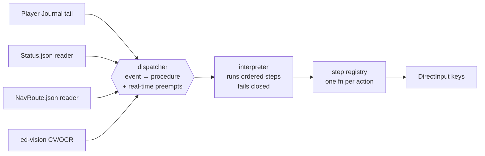

# ed-core

  
  
  
  

The **engine** of the ED-AFK workspace: the readers, the dispatcher + real-time
scene monitor, the interpreter, the step registry, boot-scene determination, and
the shared flight primitives every domain package reuses. It imports **down**
into `ed-vision` only and never imports a domain (`ed-autojump`, `ed-explore`,
`ed-combat`, `ed-trading`).

Part of the ED-AFK workspace — see the [repo-root README](../../README.md) for
the **why**, the maturity framing, and the Terms-of-Service disclaimer.

## What lives here

- **Readers** (`journal/`, `status/`) — tail the line-delimited Player Journal,
  poll `Status.json` live flags and `NavRoute.json`. Readers only update state;
  they never press a key.
- **Dispatcher + real-time scene monitor** (`flow/dispatcher.py`) — maps a live
  journal event to a procedure, then **preempts** the running procedure on
  mid-flight events: a fresh-system `FSDJump` (→ `arrival`), a star-smack
  `SupercruiseExit` at a Star/Planet (→ `smack_recovery`), and the
  **CONNECTION ERROR** modal (→ `connection_recovery`). Also owns a
  **never-strand re-dispatch** driver with bounded backoff and a **heat-sink
  watchdog** that pauses input while a UI macro owns the keyboard. A single
  `_TailHub` fans every journal event to all subscribers (main track + parallel
  honk) so no waiter eats another's event.
- **Interpreter** (`flow/interpreter.py`) — walks a procedure's ordered TOML
  steps top to bottom, tracks per-step success, and **fails closed**: any failed
  required step aborts without ever throttling forward or firing the jump.
- **Registry** (`flow/registry.py`, `flow/step_registry.py`) — the merged
  active-set surfaces (classifiers, event-routes, step table, procedure dirs)
  that domains register into; a duplicate `register_step` is a hard error.
- **Boot-scene determination** (`boot/scenes.py`) — the 11 C-series scene
  templates, determination-only, that decide which scene the ship is in at
  startup (docked / startup / arrival / refuel / traversal / exploration /
  starsmack / no-route / pause / resume / parked).
- **Shared flight primitives** (`flow/steps_shared.py`) — the tested step
  library reused by every domain: `press`, `wait`, `set_throttle`, `pitch`,
  `orient_compass` / `pitch_compass` / `hold_alignment` / `orient_widget_ring`
  (compass coarse + widget-ring fine align, both fail-closed),
  `engage_supercruise`, `wait_cooldown_clear`, `hold_until_event`,
  `connection_recovery`, and more.
- **Plumbing** — key sender + `.binds` parsing/validation (`keys/`,
  `binds_*`), MinEdLauncher launch + main-menu/private-group nav (`launcher/`),
  EDMCOverlay status writer (`overlay.py`), panic hotkey (`panic*.py`), session
  recorder (`recorder.py`), FSD fuel/danger math (`fsd_util.py`), doctor
  pre-flight (`doctor.py`), and lifecycle wiring (`lifecycle.py`).

## Dependency rule

`ed-core` depends on `ed-vision` (the perception leaf) and on nothing else in
the workspace. Domain packages depend on `ed-core`. Keep that edge one-way.

## License

**AGPL-3.0-or-later** — this package's `pyproject.toml` declares
`license = "AGPL-3.0-or-later"`, matching the ED-AFK distribution it is built to
run inside (which bundles the AGPL compass model weights via `ed-vision`). The
repo also carries a root MIT `LICENSE` file; the per-package metadata is the
binding declaration for this package.
